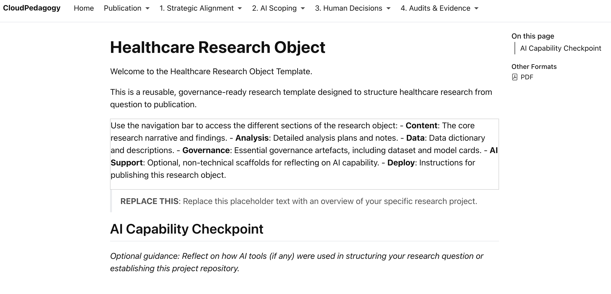

# CloudPedagogy Research Object Template

**Governance-Ready, AI-Aware Healthcare Research Infrastructure
(Quarto-Based)**

------------------------------------------------------------------------

## Overview

This repository implements a structured, governance-ready research
object for healthcare research projects using Quarto.

It provides a reproducible, navigable framework that integrates:

-   A clear research lifecycle (question → protocol → data → methods →
    results → interpretation → reuse)
-   Governance artefacts (dataset card, model card, risk register,
    decision log, reproducibility checklist)
-   Optional AI capability reflection scaffolds
-   Static, portable publication via Quarto

This is not simply a writing template.\
It encodes research transparency and governance directly into project
structure.

---

## 🌐 Live Hosted Version

👉 http://cloudpedagogy-research-object-demo.s3-website.eu-west-2.amazonaws.com/

------------------------------------------------------------------------

## 🖼️ Screenshot

This screenshot shows the fully rendered research object generated from the `/example/` project in this repository.

The demo allows users to explore the complete structure of a governance-ready research object, including:

• research lifecycle documentation  
• governance artefacts (dataset card, model card, risk register, decision log)  
• optional AI capability reflection checkpoints  
• reproducible research structure built with Quarto  

The demonstration uses entirely synthetic data and represents a fictional healthcare service utilisation study.

[](http://cloudpedagogy-research-object-demo.s3-website.eu-west-2.amazonaws.com/)


---
## 🛠️ Getting Started

### Clone the repository

```bash
git clone [repository-url]
cd [repository-folder]
```

### Install dependencies

```bash
npm install
```

### Run locally

```bash
npm run dev
```

Once running, your terminal will display a local URL (often http://localhost:5173). Open this in your browser to use the application.

### Build for production

```bash
npm run build
```

The production build will be generated in the `dist/` directory and can be deployed to any static hosting service.

---

## 🔐 Privacy & Security

- **Fully local**: All data remains in the user's browser  
- **No backend**: No external API calls or database storage  
- **Privacy-preserving**: No tracking or data exfiltration  
- Suitable for use in sensitive organisational and governance contexts  


------------------------------------------------------------------------

## What Problem This Solves

Healthcare research projects are often fragmented:

-   Manuscript in one place\
-   Code in another\
-   Governance documentation elsewhere\
-   AI usage inconsistently disclosed

This template addresses:

-   Structural fragmentation\
-   Reactive governance\
-   Opaque AI use\
-   Reproducibility gaps\
-   Inconsistent documentation practices

It transforms a research project into a coherent, version-controlled
research object.

------------------------------------------------------------------------

## What This Is Not

-   Not a data platform\
-   Not a journal replacement\
-   Not an AI automation system\
-   Not regulatory compliance software\
-   Not a learning management system

It is a lightweight infrastructure pattern for structuring and
documenting research projects responsibly.

------------------------------------------------------------------------

## Repository Structure

### Root (Template)

The root project contains the blank, reusable template:

-   Structured content pages\
-   Governance artefacts\
-   AI Capability Checkpoints (optional)\
-   Data documentation scaffolds\
-   Deployment guidance

This is the version intended for forking and reuse.

------------------------------------------------------------------------

### `/example/` (Fully Populated Demonstration)

Explore the synthetic demonstration project here:

-   Browse source: [`/example/`](./example/)

The `/example/` folder contains a synthetic, fully populated healthcare
research project:

> "Understanding Factors Associated with Missed Outpatient Appointments:
> A Synthetic Service Utilisation Study"

This example:

-   Uses entirely synthetic data\
-   Does not represent any real institution\
-   Demonstrates governance completion\
-   Demonstrates proportionate AI reflection\
-   Shows how the template can be implemented end-to-end

It serves as a working demonstration of good practice.


------------------------------------------------------------------------

## AI Capability Layer (Optional)

This template includes optional AI Capability Checkpoints aligned to a
six-domain reflection model:

-   Awareness & Orientation\
-   Human--AI Co-Agency\
-   Applied Practice & Innovation\
-   Ethics, Equity & Impact\
-   Decision-Making & Governance\
-   Reflection, Learning & Renewal

AI use is **not required**.

These sections are designed to support transparent, proportionate
documentation where AI tools are used.\
Human responsibility remains central.

---
## Detailed User Guide

For a step-by-step working guide, see:

[USER-INSTRUCTIONS.md](./USER-INSTRUCTIONS.md)

This document covers:

-   Getting started\
-   Completing governance artefacts\
-   Using AI Capability Checkpoints (optional)\
-   Rendering and exporting

------------------------------------------------------------------------

## Intended Audience

-   Healthcare researchers\
-   Service evaluation teams\
-   Applied analytics groups\
-   AI-in-health projects\
-   Governance-conscious research teams\
-   Institutions seeking lightweight transparency structures

------------------------------------------------------------------------

## Positioning Within CloudPedagogy

This project extends the CloudPedagogy ecosystem from curriculum
infrastructure into research infrastructure.

It demonstrates how governance and AI capability principles can be
operationalised in research practice.

---

## Disclaimer

This repository contains exploratory, framework-aligned tools developed for reflection, learning, and discussion.

These tools are provided **as-is** and are not production systems, audits, or compliance instruments. Outputs are indicative only and should be interpreted in context using professional judgement.

All applications are designed to run locally in the browser. No user data is collected, stored, or transmitted.

---

## Licensing & Scope

This repository contains open-source software released under the MIT License.

CloudPedagogy frameworks and related materials are licensed separately and are not embedded or enforced within this software.

---

## About CloudPedagogy

CloudPedagogy develops open, governance-credible resources for building confident, responsible AI capability across education, research, and public service.

- Website: https://www.cloudpedagogy.com/
- Framework: https://github.com/cloudpedagogy/cloudpedagogy-ai-capability-framework
